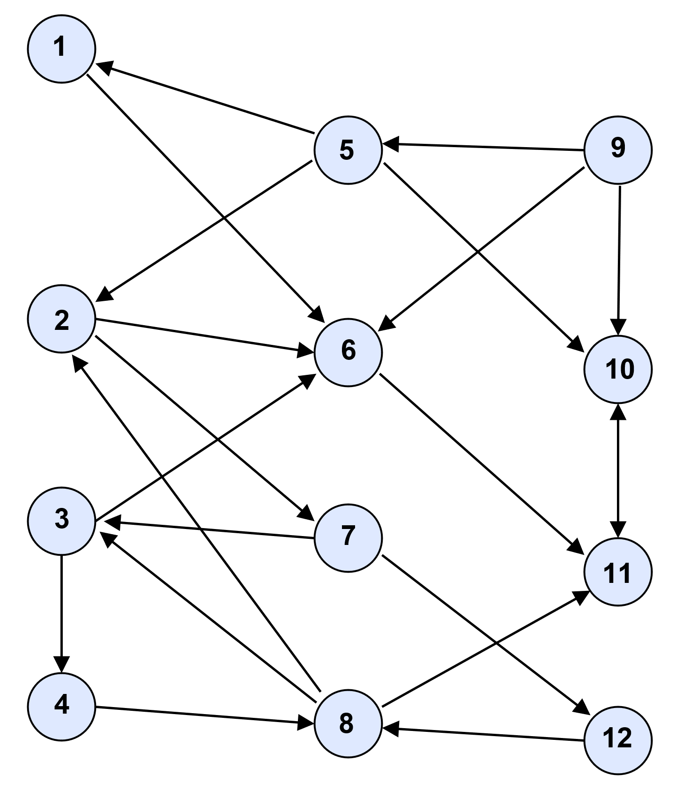
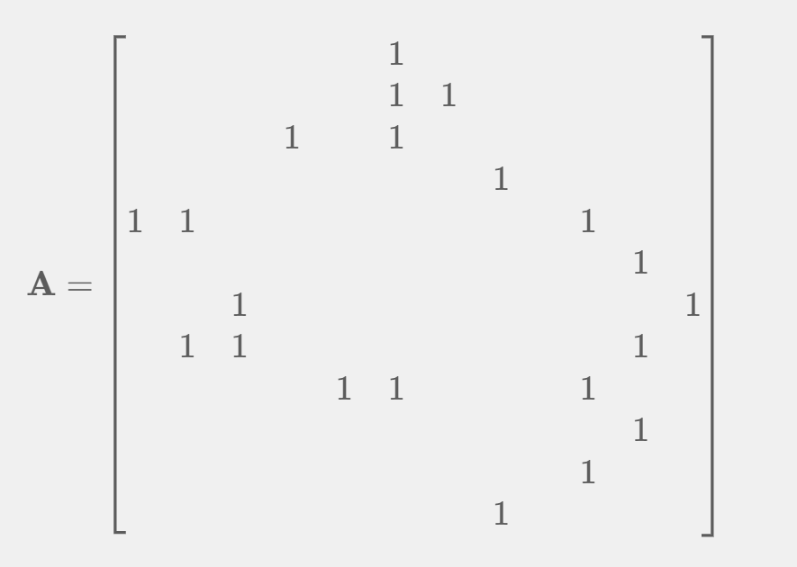
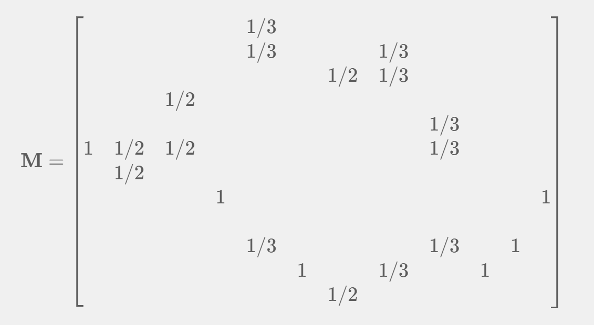

## Theoretical Exercise 4.1: Hubs, Authorities, and PageRank

Consider the following directed network:



In this exercise, we analyze the nodes in the network using three important measures: **hub scores**, **authority scores**, and **PageRank**. These measures help us understand the roles that nodes play in the given network. In this exercise, we apply the original **HITS (Hyperlink-Induced Topic Search)** algorithm.

### Task 4.1a
We have defined matrices $\mathbf{M}$ and $\mathbf{A}$ for the iterative computations of HITS and PageRank. The following update rules are used:

$$\mathbf{A}^{(t+1)}=\frac{1-\alpha }{N}\cdot\mathbf{1}+\alpha\cdot\mathbf{M}\cdot\mathbf{r}^{\left(t\right)}$$ 

$$\mathbf{h}^{(t+1)}=\mathbf{A}\cdot \mathbf{a}^{\left(t\right)}$$

$$\mathbf{a}^{\left(t+1\right)}=\mathbf{A}^⊤\cdot\mathbf{h}^{(t)}$$

Compute the matrices for the network shown above. This includes constructing the adjacency matrix, the transition matrix, and the matrices used during the HITS and PageRank iterations.


> <details>
> <summary>Solution</summary>
> <br>
>
> To get matrix $𝐀$, we set the component $a_{i,j}$ to 1 if there is a link from node $i$ to node $j$. The rows in $𝐀$ show all outgoing links and the columns in $𝐀$ show all incoming links. So, we get (empty cells are 0):
> 
>
>
> <br>
> 
> We get the matrix $𝐌$ by setting the component $m_{i,j}$ to 1 over the number of outgoing links of node $j$ if node $j$ has a link to node $i$. This results in a transposed view compared to $𝐀$. Rows contain incoming links and columns contain outgoing links. In our case, all nodes have outgoing links, so the special case from the script does not apply.
>
>
>
> <br>
> </details>


---

### Task 4.1b
Write a program that computes the hub, authority, and PageRank values using a fixed-point iteration method. Your program should:
- Initialize the vectors (e.g., with uniform values)
- Iteratively apply the update equations
- Normalize after each step
- Continue until convergence or until a maximum number of iterations is reached


> <details>
> <summary>Solution</summary>
> <br>
>
> The following code is written for scilab (a free version of Matlab):
> ```matlab
> A = [0 0 0 0 0 1 0 0 0 0 0 0;
>      0 0 0 0 0 1 1 0 0 0 0 0;
>      0 0 0 1 0 1 0 0 0 0 0 0;
>      0 0 0 0 0 0 0 1 0 0 0 0;
>      1 1 0 0 0 0 0 0 0 1 0 0;
>      0 0 0 0 0 0 0 0 0 0 1 0;
>      0 0 1 0 0 0 0 0 0 0 0 1;
>      0 1 1 0 0 0 0 0 0 0 1 0;
>      0 0 0 0 1 1 0 0 0 1 0 0;
>      0 0 0 0 0 0 0 0 0 0 1 0;
>      0 0 0 0 0 0 0 0 0 1 0 0;
>      0 0 0 0 0 0 0 1 0 0 0 0];
> h(1:size(A,1),1) = sqrt(size(A,1))/size(A,1);
> ho = zeros(size(A,1), 1);
> a = h; ao = ho; 
> i = 0;
> while (i < 100) && (norm(a-ao) > 1.0E-03)
> 	ao = a; ho = h;
> 	a = A'*ho; h = A*ao;
> 	a = a/norm(a); h = h/norm(h);
> 	i = i+1;
> end
> [s,auths]=gsort(a);
> [s,hubs]=gsort(h);
> auths
> hubs
> 
> M = A'*diag(1./sum(A',1));
> alpha = 0.85;
> N = size(A,1);
> r = ones(size(A,1), 1)./N;
> ro = zeros(size(A,1), 1);
> i = 0;
> while (i < 100) && (norm(r-ro) > 1.0E-03)
> 	ro = r; 
> 	r=(1-alpha)/N*ones(N,1)+alpha*M*ro
> 	i = i+1;
> end
> [s,ranks]=gsort(r);
> ranks
> ```
>
> <br>
> </details>

---

### Task 4.1c

Identify the top-ranking nodes according to:
- **Hub scores**: Which nodes serve as the best “link providers”?
- **Authority scores**: Which nodes receive the most valuable incoming links?
- **PageRank**: Which nodes are, overall, the most important within the network?

Discuss how and why these rankings differ. Consider whether certain nodes act predominantly as hubs, others as authorities, and whether PageRank gives a different perspective on node importance.


> <details>
> <summary>Solution</summary>
> <br>
>
> We get the following results for our example graph (PageRank with $\alpha =0.85$):
> ```text
>      authority:   6 > 10 > 2 > 5 > 1 > 11 >  4 > 7 >  3 > 12 > 8 > 9
>      hub:         9 >  5 > 2 > 3 > 1 >  8 > 11 > 6 >  7 > 10 > 4 > 12
>      PageRank:   11 > 10 > 6 > 8 > 3 >  2 >  4 > 7 > 12 >  1 > 5 > 9
> ```
> 
> <br>
> </details>
